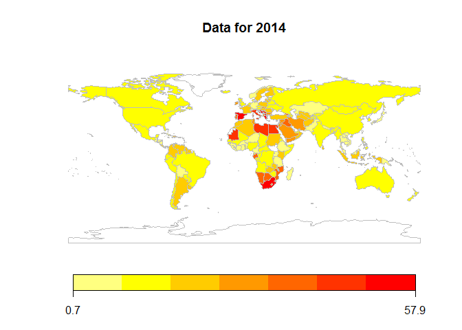

World Bank Unemployment- EDA
================

Importing and understanding data
--------------------------------

``` r
library(dplyr)
library(knitr)
data = read.csv("D:/EDA/API_ILO_country_YU.csv",na.strings = '')

codes = read.csv('D:/EDA/world-bank-youth-unemployment/codes.txt')
codes = codes[,c(3,6)]
colnames(codes)[1]='Country.Code'
data_regions = merge(data,codes, by = 'Country.Code')
nrow(data_regions)
```

    ## [1] 174

``` r
data = data_regions
View(data)
dim(data)
```

    ## [1] 174   8

-   So the dataset contains unemployment rates for 174 countries for 5 years - 2010 to 2014 categorised according to continents!
-   There are no missing values in the dataset! hats off to WB for the awesome dataset!!

-   Things we can do
-   plot the data for 5 years on map +
-   animate into gif to show change in unemployment rates over the years
-   see year wise trends

Mapping the data into map
-------------------------

``` r
library(ggplot2)
library(ggmap)
library(maps)
library(mapdata)
library(rworldmap)

map_data = joinCountryData2Map(data,joinCode = "NAME",nameJoinColumn = "Country.Name")
```

    ## 170 codes from your data successfully matched countries in the map
    ## 4 codes from your data failed to match with a country code in the map
    ## 73 codes from the map weren't represented in your data

``` r
map_2010 = mapCountryData(map_data,nameColumnToPlot = 'X2010',catMethod = 'logfixedwidth',addLegend = T,mapTitle = "Data for 2010")
```


``` r
map_2011 = mapCountryData(map_data,nameColumnToPlot = 'X2011',catMethod = 'logfixedwidth',addLegend = T,mapTitle = "Data for 2011")
```


``` r
map_2012 = mapCountryData(map_data,nameColumnToPlot = 'X2012',catMethod = 'logfixedwidth',addLegend = T,mapTitle = "Data for 2012")
```


``` r
map_2013 = mapCountryData(map_data,nameColumnToPlot = 'X2013',catMethod = 'logfixedwidth',addLegend = T,mapTitle = "Data for 2013")
```


``` r
map_2014 = mapCountryData(map_data,nameColumnToPlot = 'X2014',catMethod = 'logfixedwidth',addLegend = T,mapTitle = "Data for 2014")
```

 - OK!, we have the maps. We can already see some patterns in the unemployment rates and the regions facing high unemployment rates. - Some countries in Europe and Asia have had a deeper rate of unemployment. - In the US, the job scenario has improved since the 2009 financial meltdown - In South America, things have in deteriorating in the past 5 years - Theres only so much a map can say. Now onto numbers! - Let's have a look at what the numbers say!

Unemployment trends across the world
------------------------------------

-   Things we will do
-   year wise avg unemployment
-   country wise avg unemployment
-   find deeply affected countries
-   find less affected countries

``` r
year_avgs = data %>% select("X2010","X2011","X2012","X2013","X2014") %>% colMeans()
country_avgs = data %>% select("X2010","X2011","X2012","X2013","X2014") %>% rowMeans()
data1 = cbind(data,country_avgs)                     
data1 = rbind(data1,year_avgs)

data3 = data[-c(1,2,8)]
min_rate = apply(data3,1,min)
max_rate = apply(data3,1,max)
data3 = cbind(data3,min_rate,max_rate,country_avgs) #contain the data matrix with min, max and avg
data3 = cbind(data[c(1,2,8)],data3)
kable(data3[1:20,])
```

| Country.Code | Country.Name           | region   |  X2010|  X2011|  X2012|  X2013|  X2014|  min\_rate|  max\_rate|  country\_avgs|
|:-------------|:-----------------------|:---------|------:|------:|------:|------:|------:|----------:|----------:|--------------:|
| AFG          | Afghanistan            | Asia     |   20.6|   20.9|   19.7|   21.1|   20.8|       19.7|       21.1|          20.62|
| AGO          | Angola                 | Africa   |   10.8|   10.7|   10.7|   10.6|   10.5|       10.5|       10.8|          10.66|
| ALB          | Albania                | Europe   |   25.8|   27.0|   28.3|   28.7|   29.2|       25.8|       29.2|          27.80|
| ARE          | United Arab Emirates   | Asia     |    9.8|    9.8|    9.8|    9.9|   10.0|        9.8|       10.0|           9.86|
| ARG          | Argentina              | Americas |   19.5|   18.8|   18.4|   19.7|   21.3|       18.4|       21.3|          19.54|
| ARM          | Armenia                | Asia     |   38.3|   38.7|   35.0|   32.5|   35.1|       32.5|       38.7|          35.92|
| AUS          | Australia              | Oceania  |   11.4|   11.4|   11.7|   12.2|   13.1|       11.4|       13.1|          11.96|
| AUT          | Austria                | Europe   |    8.8|    8.2|    8.7|    9.1|    9.2|        8.2|        9.2|           8.80|
| AZE          | Azerbaijan             | Asia     |   14.6|   14.5|   14.3|   13.4|   13.6|       13.4|       14.6|          14.08|
| BDI          | Burundi                | Africa   |   10.8|   10.8|   10.8|   10.8|   10.7|       10.7|       10.8|          10.78|
| BEL          | Belgium                | Europe   |   22.5|   18.6|   19.7|   23.1|   23.6|       18.6|       23.6|          21.50|
| BEN          | Benin                  | Africa   |    2.0|    2.0|    2.0|    1.8|    1.7|        1.7|        2.0|           1.90|
| BFA          | Burkina Faso           | Africa   |    5.2|    5.3|    5.2|    5.2|    5.0|        5.0|        5.3|           5.18|
| BGD          | Bangladesh             | Asia     |    8.2|    8.2|    8.2|    8.9|    9.1|        8.2|        9.1|           8.52|
| BGR          | Bulgaria               | Europe   |   22.9|   25.2|   28.2|   29.7|   25.9|       22.9|       29.7|          26.38|
| BHR          | Bahrain                | Asia     |   10.2|   11.4|   10.5|   10.6|   10.9|       10.2|       11.4|          10.72|
| BHS          | Bahamas, The           | Americas |   36.0|   27.2|   30.4|   30.8|   30.1|       27.2|       36.0|          30.90|
| BIH          | Bosnia and Herzegovina | Europe   |   57.2|   57.1|   61.7|   57.4|   57.5|       57.1|       61.7|          58.18|
| BLR          | Belarus                | Europe   |   13.2|   12.5|   11.8|   12.0|   12.0|       11.8|       13.2|          12.30|
| BLZ          | Belize                 | Americas |   20.9|   24.3|   26.0|   22.4|   22.0|       20.9|       26.0|          23.12|

``` r
View(data3)
```

Now some Analysis
-----------------

-   Countries with high rates of unemployment

``` r
high_rates1 = data3 %>% arrange(-country_avgs)
high_rates1 = head(high_rates1,50)
kable(high_rates1[1:10,])
```

| Country.Code | Country.Name           | region |  X2010|  X2011|  X2012|  X2013|  X2014|  min\_rate|  max\_rate|  country\_avgs|
|:-------------|:-----------------------|:-------|------:|------:|------:|------:|------:|----------:|----------:|--------------:|
| BIH          | Bosnia and Herzegovina | Europe |   57.2|   57.1|   61.7|   57.4|   57.5|       57.1|       61.7|          58.18|
| MKD          | Macedonia, FYR         | Europe |   53.7|   55.4|   53.8|   51.8|   50.8|       50.8|       55.4|          53.10|
| ESP          | Spain                  | Europe |   42.5|   47.1|   54.3|   57.1|   57.9|       42.5|       57.9|          51.78|
| ZAF          | South Africa           | Africa |   50.8|   50.1|   52.2|   51.4|   52.6|       50.1|       52.6|          51.42|
| SRB          | Serbia                 | Europe |   45.5|   50.4|   50.6|   49.7|   49.5|       45.5|       50.6|          49.14|
| GRC          | Greece                 | Europe |   32.4|   44.1|   54.7|   58.0|   53.9|       32.4|       58.0|          48.62|
| MRT          | Mauritania             | Africa |   46.7|   46.7|   46.5|   46.6|   46.6|       46.5|       46.7|          46.62|
| LBY          | Libya                  | Africa |   43.8|   42.6|   46.2|   47.0|   48.9|       42.6|       48.9|          45.70|
| SWZ          | Swaziland              | Africa |   42.0|   42.2|   42.0|   42.0|   42.6|       42.0|       42.6|          42.16|
| HRV          | Croatia                | Europe |   33.5|   36.6|   44.1|   50.3|   45.9|       33.5|       50.3|          42.08|

``` r
high_rates1$Country.Name = factor(high_rates1$Country.Name, levels = high_rates1$Country.Name[order(high_rates1$country_avgs)])


ggplot(data = high_rates1)  + geom_segment(aes(x=min_rate,xend = max_rate,y = Country.Name,yend = Country.Name),colour = 'blue') + geom_point(aes(x=country_avgs,y = Country.Name,colour = region))
```

 - The countries towards the top have the highest average unemployment rates. The length of the lines represent the minimum and maximum unemployment rates during the period(2010-2014) - In the top 10 countries with high unemployment, 6 are from Europe and 4 from Africa.

-   Countries with low rates of unemployment

``` r
low_rates1 = data3 %>% arrange(country_avgs)
low_rates1 = head(low_rates1,50)
kable(low_rates1[1:10,])
```

| Country.Code | Country.Name     | region |  X2010|  X2011|  X2012|  X2013|  X2014|  min\_rate|  max\_rate|  country\_avgs|
|:-------------|:-----------------|:-------|------:|------:|------:|------:|------:|----------:|----------:|--------------:|
| RWA          | Rwanda           | Africa |    0.7|    0.7|    0.7|    0.7|    0.7|        0.7|        0.7|           0.70|
| KHM          | Cambodia         | Asia   |    0.9|    0.7|    0.5|    0.7|    0.9|        0.5|        0.9|           0.74|
| QAT          | Qatar            | Asia   |    1.5|    1.7|    1.6|    1.2|    1.3|        1.2|        1.7|           1.46|
| GIN          | Guinea           | Africa |    1.9|    1.4|    1.4|    1.5|    1.7|        1.4|        1.9|           1.58|
| BEN          | Benin            | Africa |    2.0|    2.0|    2.0|    1.8|    1.7|        1.7|        2.0|           1.90|
| LAO          | Lao PDR          | Asia   |    3.2|    3.2|    3.3|    3.3|    3.4|        3.2|        3.4|           3.28|
| THA          | Thailand         | Asia   |    4.0|    2.9|    3.1|    3.2|    3.9|        2.9|        4.0|           3.42|
| NPL          | Nepal            | Asia   |    4.0|    4.0|    4.0|    4.0|    4.0|        4.0|        4.0|           4.00|
| MAC          | Macao SAR, China | Asia   |    5.3|    5.8|    5.0|    3.5|    2.9|        2.9|        5.8|           4.50|
| KAZ          | Kazakhstan       | Asia   |    6.0|    5.3|    4.6|    4.1|    3.5|        3.5|        6.0|           4.70|

``` r
low_rates1$Country.Name = factor(low_rates1$Country.Name, levels = low_rates1$Country.Name[order(-low_rates1$country_avgs)])


ggplot(data = low_rates1) + geom_point(aes(x=country_avgs,y = Country.Name,colour =region)) + geom_segment(aes(x=min_rate,xend = max_rate,y = Country.Name,yend = Country.Name),colour = 'blue')
```


-   African and Asian nations dominate the list of lowest unemployment rates. 7 countries from Africa and 3 from Asia. Showing tha the Economic cricis of 2008 had hit Europe and America the hardest.While Asian and African countries were least affected.

Trend of world unemployment rates across years
----------------------------------------------

-   year wise unemployment rate across the world

``` r
library(reshape)

data_melt = melt(data)
View(data_melt)
#nrow(data_melt) - for check

ggplot(data = data_melt) + geom_jitter(aes(x=variable,y=value,colour = region)) +  geom_boxplot(aes(x=variable,y = value),alpha = 0.6,outlier.color = NA) 
```


``` r
data_melt$variable= gsub(data_melt$variable,pattern = 'X',replacement = '')
data_melt %>% group_by(variable) %>% summarise(avg = mean(value,na.rm = T)) %>% ggplot() +  geom_smooth(aes(x=as.numeric(variable), y= avg),colour = 'blue') + geom_point(aes(x=as.numeric(variable), y= avg),colour = 'red')
```


